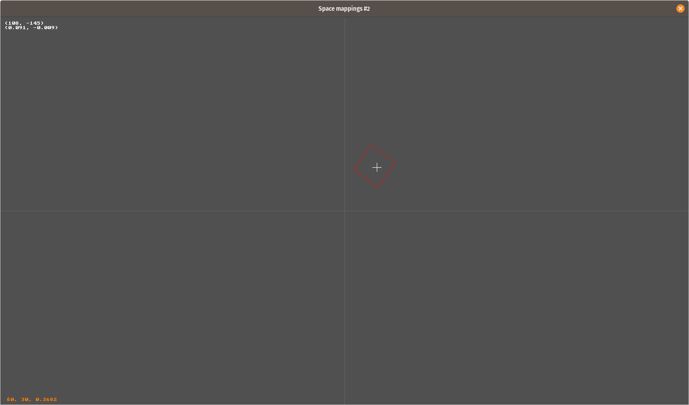

# Examples
The examples are designed to show how to use **Ranger**. Ultimately you will build your own Nodes as you build your game.

All examples can run simply by using:

```> go run .```

at the *CLI* within the specific directory.

-----------------------------------------------------------------
## Basic
Basic is as simple as it gets. It starts the engine, prints the display size and waits for 3 seconds.

-----------------------------------------------------------------
## Minimal
Minimal takes the next step and creates the two basic **Nodes** that make up a minimalistic shell: a Boot and Scene nodes.

-----------------------------------------------------------------
The Boot **Node** exists solely to demonstrate transitioning from one Scene to another. A Boot node would typically be used for things that need to happen before any other node runs, perhaps a connection to the network.

The Scene node shows an example of drawing a background--checkboard in this example--and a *hand coded* line. Typically you would create an actual **Node**, for example, there is a custom **LineNode** you would normally use.

-----------------------------------------------------------------
## GameLayer
GameLayer emphasizes a child *Layer* Node as the background instead of a Scene Node. Games should always use the Scene Node for transitions and *Layer* type Nodes for backgrounds and game content.

Note: A lot of the examples have the Scene node drawing the background for simplicity.

-----------------------------------------------------------------
## Raster text
Raster text is a simple example of using the raster font. The font is a stripped down port from the [font8x8](https://crates.io/crates/font8x8/0.2.3) [Rust](https://www.rust-lang.org/) crate. At the time of this writing enhancements that allow transformations on the font are planned.

-----------------------------------------------------------------
## Vector text
Vector text is a simple example of the using a handcrafted Vector font. The lower-case characters are not complete at the time of this writing, however, it is quite usable. **TODO** complete Vector font lower case characters.

-----------------------------------------------------------------
## Space mappings 1
In most Scene graphs there are several *common* coordinates spaces: World, Device, View and Node.

* **World**-space is infinite in size and only a portion is visible at any one time. This is the lest used and is not really accessible to the user only because it doesn't have much use.
* **Device**-space is finite in size and limited by the physical structure of the device, for example, a cell phone or mouse coordinates (aka **mouse-space**).
* **View**-space is a virtual space artificially defined by the developer, similar in concept to virtual consoles like [Pico8](https://www.lexaloffle.com/pico-8.php). It is still infinite in size but virtual bounds are mapped to **Device** space.
* **Node**-space is the coordinate space relative to a **Node**, typically seen as local-space.

*Space mappings #1* is an example that shows how to map *mouse-space* to *view-space* using the *MapDeviceToView* method.

Every **Node** can register for events, either Timming or IO. This example shows how a node registers itself for IO events via Enter/Exit lifecycle events.

-----------------------------------------------------------------
## Space mappings 2
*Space mapping #2* adds to #1 by using the provided custom/RectangleNode. This node uses the *MapDeviceToNode* and *PointInside* methods, and serves as an example for mapping techniques.

```Go
nodes.MapDeviceToNode(r.world, mx, my, r, r.localPosition)
r.pointInside = r.polygon.PointInside(r.localPosition)
```

This allows the node's *Draw* to change the node's draw color according to the *pointInside* boolean.

```Go
if r.pointInside {
	context.SetDrawColor(r.insideColor)
} else {
	context.SetDrawColor(r.color)
}
context.RenderPolygon(r.polygon, api.CLOSED)
```

### Example Image


-----------------------------------------------------------------
## Update Targets
Update targets expands on *Space mapping #2* example by adding an Angular Motion object in order to control the rotation of the rectangle:

```Go
g.angularMotion = animation.NewAngularMotion()
// amgle is measured in angular-velocity or "degrees/second"
g.angularMotion.SetRate(maths.DegreeToRadians * -90.0)
```

We then *Update* the motion object before calculating the next interpolation value:

```Go
func (g *gameLayer) Update(dt float64) {
	g.angularMotion.Update(dt)
}
```

This is updated on each frame by the *Interpolation* method which is called by the **NodeManager**:

```Go
func (g *gameLayer) Interpolate(interpolation float64) {
	value := g.angularMotion.Interpolate(interpolation)
	g.rectNode.SetRotation(value.(float64))
}
````

The rectangle is updated with the return value of the interpolation.

-----------------------------------------------------------------
## Zooming
The zooming example adds to the *Update Targets* example by adding a **ZoomNode**--as a child--to the **GameLayer**.

Any children added the **ZoomNode** are then subject to zooming via the mouse wheel.

First you construct the **ZoomNode** in the *Build* method:

```Go
g.zoom = custom.NewZoomNode("ZoomNode", g)
g.zoom.Build(world)
```

Next, when you construct your, for example **RectangleNode**, you assign the node's parent as the **ZoomNode**:

```Go
g.rectNode = custom.NewRectangleNodeWithParent("Orange Rect", g.zoom)
```

It is important that you use the **ZoomNode** as the parent otherwise dragging will not function correctly. This is because dragging a **Node** is based on the node's parent and in this case the rectangle's parent *is* the **ZoomNode**. Hint: you know you assign the wrong parent when you see that dragging a node either lags behind or zips a head or of the mouse.

Now you can add any children. In this example just the **RectangleNode** is added:

```Go
g.zoom.AddChild(g.rectNode)
```

And finally you add the **ZoomNode**--as a child--to the **GameLayer** "g":

```Go
g.AddChild(g.zoom)
```

That's it. If you move the mouse pointer to one edge of the rectangle and zoom you will see the rectangle shrink and grow right at the corner. If you move to another corner it will pickup zooming there.

Note: You don't have to use the mouse. You can programmatically control where zooming occurs, for example, you may have a **Zone** widget defined such that when an object enters the zone the code zooms into the zone, and when it exist it zooms back out. You can even use a **Tweening** animation to smoothly zoom in or out.

-----------------------------------------------------------------
